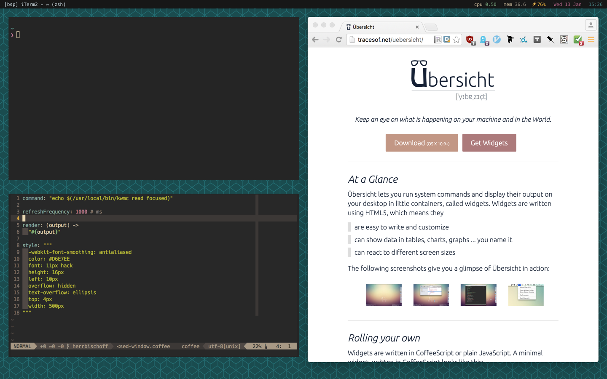

# nerdbar.widget



Übersicht system information bar for use with kwm window manager. Inspired by screenshots of the [kwm window manager](https://github.com/koekeishiya/kwm) and the [authors' NerdTool configuration](https://github.com/koekeishiya/kwm/issues/8#issuecomment-166608067).

In the screenshot above I'm using the excellent [Hack typeface](https://github.com/chrissimpkins/hack). The version here uses Osaka Mono — in spirit of the original.

## Installation

Make sure you have [Übersicht](http://tracesof.net/uebersicht/) installed.

Then clone this repository.

```bash
git clone https://github.com/herrbischoff/nerdbar.widget $HOME/Library/Application\ Support/Übersicht/widgets/nerdbar.widget
```

## Send a Tip my Way

In case you feel particularly generous today, you can buy me a coffee. That would really make my day. Kindness of strangers and all that. If you can't or won't, no hard feelings.

Bitcoin: `1HXi42h9Uk5LmDrq1rVv8ykaFoeARTXw9P`
